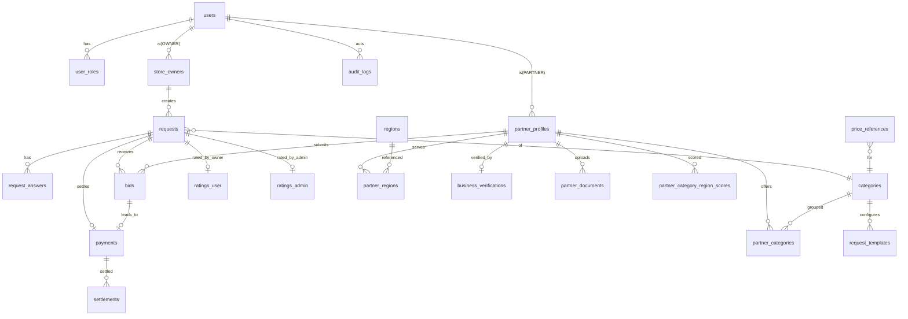

# 우리동네고수 — ERD.md (Entity Relationship Diagram)

> PostgreSQL + PostGIS 기준. 모든 테이블 RLS 적용 전제. PK는 uuid(기본), 단 `users.uid`는 Firebase uid(text).

---

## 1. 개체 관계도 (Mermaid)



---

## 2. 테이블 정의 (DDL 요약)

### 2.1 users / roles
```sql
create table users (
  uid          text primary key,            -- Firebase uid
  email        text unique,
  display_name text,
  phone        text,
  status       text default 'active',       -- active/dormant/withdrawn
  created_at   timestamptz default now()
);

create type role_type as enum ('OWNER','PARTNER','ADMIN','SUPER_ADMIN');
create table user_roles (
  id         uuid primary key default gen_random_uuid(),
  uid        text references users(uid) on delete cascade,
  role       role_type not null,
  granted_by text references users(uid),     -- 관리자 지정 추적(자가승격 금지)
  created_at timestamptz default now(),
  unique(uid, role)
);
```

### 2.2 store_owners (경영주/점포)
```sql
create table store_owners (
  id          uuid primary key default gen_random_uuid(),
  uid         text references users(uid) on delete cascade,
  store_name  text,
  store_type  text,                          -- 편의점 브랜드/유형
  address     text,
  sigungu_code text,
  geom        geography(point,4326),
  created_at  timestamptz default now()
);
```

### 2.3 categories (공종) / request_templates
```sql
create table categories (
  id          uuid primary key default gen_random_uuid(),
  code        text unique,                   -- HVAC_REPAIR, HVAC_CLEAN, DEMOLITION ...
  name        text not null,                 -- 냉난방기 수리 등
  description text,
  icon        text,
  active      boolean default true
);

-- 공종별 3~5단계 질문 스키마(JSON)
create table request_templates (
  id          uuid primary key default gen_random_uuid(),
  category_id uuid references categories(id),
  version     int default 1,
  steps       jsonb not null,                -- [{step, title, fields:[...]}...]
  active      boolean default true,
  created_at  timestamptz default now()
);
```

### 2.4 requests (견적요청) / request_answers
```sql
create type request_status as enum
  ('draft','open','bidding','awarded','in_progress','completed','canceled','expired');
create type pay_method as enum ('instant','hq');   -- 즉시결제 / 본부결제

create table requests (
  id           uuid primary key default gen_random_uuid(),
  owner_id     uuid references store_owners(id),
  owner_uid    text references users(uid),    -- RLS 편의
  category_id  uuid references categories(id),
  title        text,
  address      text,
  sigungu_code text,
  geom         geography(point,4326),
  urgency      text,                          -- now/today/this_week/flexible
  pay_method   pay_method,
  status       request_status default 'open',
  bid_deadline timestamptz,
  created_at   timestamptz default now()
);

create table request_answers (
  id         uuid primary key default gen_random_uuid(),
  request_id uuid references requests(id) on delete cascade,
  field_key  text,
  value      jsonb,
  media_url  text                             -- 사진/영상
);
```

### 2.5 partner_profiles & 부속
```sql
create type partner_kind as enum ('corporation','sole_proprietor','individual'); -- 법인/개인사업자/무사업자
create type partner_status as enum ('pending','approved','rejected','suspended');

create table partner_profiles (
  id              uuid primary key default gen_random_uuid(),
  uid             text references users(uid) on delete cascade,
  kind            partner_kind not null,
  name            text,                        -- 상호 또는 이름
  biz_reg_no      text,                        -- 사업자등록번호(있을 때)
  base_address    text,
  geom            geography(point,4326),
  service_radius_m int default 20000,
  responsiveness  numeric default 0,           -- 응답성 지표
  status          partner_status default 'pending',
  rejected_reason text,
  created_at      timestamptz default now()
);

create table partner_categories (             -- 보유 공종(복수)
  partner_id  uuid references partner_profiles(id) on delete cascade,
  category_id uuid references categories(id),
  primary key (partner_id, category_id)
);

create table regions (                         -- 시군구 마스터
  sigungu_code text primary key,
  sido         text,
  sigungu      text,
  geom         geography(multipolygon,4326)
);

create table partner_regions (                 -- 서비스 지역(복수)
  partner_id   uuid references partner_profiles(id) on delete cascade,
  sigungu_code text references regions(sigungu_code),
  primary key (partner_id, sigungu_code)
);

create table partner_documents (               -- 자격증/보험/포트폴리오
  id         uuid primary key default gen_random_uuid(),
  partner_id uuid references partner_profiles(id) on delete cascade,
  doc_type   text,                             -- license/insurance/portfolio
  file_url   text,
  verified   boolean default false,
  created_at timestamptz default now()
);

create table business_verifications (          -- 국세청 진위확인 결과
  id           uuid primary key default gen_random_uuid(),
  partner_id   uuid references partner_profiles(id) on delete cascade,
  biz_reg_no   text,
  verified     boolean default false,
  biz_status   text,                           -- 계속/휴업/폐업
  tax_type     text,
  checked_at   timestamptz default now(),
  raw          jsonb
);
```

### 2.6 bids (입찰)
```sql
create type bid_status as enum ('submitted','withdrawn','awarded','rejected','expired');
create table bids (
  id          uuid primary key default gen_random_uuid(),
  request_id  uuid references requests(id) on delete cascade,
  partner_id  uuid references partner_profiles(id),
  amount      numeric not null,
  message     text,
  quote_url   text,                            -- 견적서(첨부 또는 AI생성)
  est_schedule text,
  status      bid_status default 'submitted',
  created_at  timestamptz default now()
);
```

### 2.7 평가 (이원화)
```sql
create table ratings_user (                    -- 사용자평가(OWNER)
  id          uuid primary key default gen_random_uuid(),
  request_id  uuid references requests(id),
  partner_id  uuid references partner_profiles(id),
  owner_uid   text references users(uid),
  stars       numeric check (stars between 0 and 5),
  quality     numeric, price_fair numeric, kindness numeric, punctuality numeric,
  comment     text, media_url text,
  created_at  timestamptz default now()
);

create table ratings_admin (                   -- 관리자평가(ADMIN)
  id          uuid primary key default gen_random_uuid(),
  request_id  uuid references requests(id),
  partner_id  uuid references partner_profiles(id),
  admin_uid   text references users(uid),
  compliance numeric, settlement numeric, claim_response numeric, safety numeric, docs numeric,
  comment     text,
  created_at  timestamptz default now()
);

-- 공종×지역 종합 점수(매칭 노출용, 배치/트리거 산출)
create table partner_category_region_scores (
  partner_id   uuid references partner_profiles(id),
  category_id  uuid references categories(id),
  sigungu_code text references regions(sigungu_code),
  score        numeric default 0,             -- 0~5 (사용자+관리자 가중)
  sample_count int default 0,
  updated_at   timestamptz default now(),
  primary key (partner_id, category_id, sigungu_code)
);
```

### 2.8 결제·정산
```sql
create type pay_status as enum ('pending','paid','escrow_held','released','refunded','failed','hq_approved','hq_settled');
create table payments (
  id          uuid primary key default gen_random_uuid(),
  request_id  uuid references requests(id),
  bid_id      uuid references bids(id),
  method      pay_method,                      -- instant/hq
  amount      numeric,
  status      pay_status default 'pending',
  pg_tx_id    text,                            -- 즉시결제 PG 거래키
  approved_by text references users(uid),      -- 본부결제 승인자
  created_at  timestamptz default now()
);

create table settlements (                     -- 협력사 정산/원천징수
  id            uuid primary key default gen_random_uuid(),
  payment_id    uuid references payments(id),
  partner_id    uuid references partner_profiles(id),
  gross_amount  numeric,
  withholding   numeric default 0,             -- 무사업자 3.3% 등
  net_amount    numeric,
  tax_doc_type  text,                          -- 세금계산서/현금영수증/지급명세서
  settled_at    timestamptz
);
```

### 2.9 알림 / 단가참고 / 감사
```sql
create table notifications (
  id         uuid primary key default gen_random_uuid(),
  to_uid     text references users(uid),
  type       text,                             -- match/bid/award/settle/rating
  payload    jsonb,
  channel    text,                             -- fcm/alimtalk
  read_at    timestamptz,
  created_at timestamptz default now()
);

create table price_references (                 -- 전국/지방/현재 단가, 표준인건비, 유가
  id           uuid primary key default gen_random_uuid(),
  category_id  uuid references categories(id),
  scope        text,                            -- national/regional/current
  sigungu_code text,
  metric       text,                            -- labor_rate/fuel/avg_bid
  value        numeric,
  source       text,                            -- opinet/공개데이터/내부집계
  ref_date     date
);

create table audit_logs (
  id         uuid primary key default gen_random_uuid(),
  actor_uid  text references users(uid),
  action     text,                              -- role_grant/approve/pay/rate ...
  target     text,
  detail     jsonb,
  created_at timestamptz default now()
);
```

---

## 3. 핵심 인덱스

```sql
create index on partner_profiles using gist (geom);
create index on requests using gist (geom);
create index on regions using gist (geom);
create index on partner_categories (category_id);
create index on partner_regions (sigungu_code);
create index on bids (request_id, status);
create index on partner_category_region_scores (category_id, sigungu_code, score desc);
```

---

## 4. 상태 전이 (requests)

```
draft → open → bidding → awarded → in_progress → completed
                   └→ expired / canceled
```

## 5. 점수 산출 규칙(요약)
- 공종×지역 score = `0.7·사용자평가평균 + 0.3·관리자평가평균`(가중치 ADMIN 조정 가능).
- 표본수 적을 때 베이지안 평활(전체평균으로 보정) 적용 권장.
