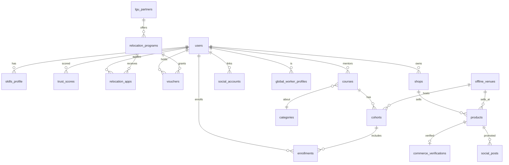

# 우리동네고수 — ERD-PHASE2.md (데이터 모델 확장)

> Phase 1 ERD(`erd.md`)를 **확장**한다. 기존 `users`, `partner_profiles`, `categories`, `regions`, `requests`, `ratings_*`를 재사용하고 신규 테이블을 추가한다.

---

## 1. 확장 관계도 (Mermaid)



---

## 2. 신규 테이블 (DDL 요약)

### M1. 스킬/희망분야
```sql
create type skill_kind as enum ('strength','aspiration');   -- 잘하는 / 잘하고싶은
create table skills_profile (
  id          uuid primary key default gen_random_uuid(),
  uid         text references users(uid) on delete cascade,
  category_id uuid references categories(id),
  kind        skill_kind not null,
  level       int,                         -- 1~5 숙련도(strength)
  note        text,
  created_at  timestamptz default now(),
  unique(uid, category_id, kind)
);
```

### M2. 코스/기수/수강/수료
```sql
create table courses (
  id          uuid primary key default gen_random_uuid(),
  mentor_uid  text references users(uid),    -- MENTOR
  category_id uuid references categories(id),
  title       text, summary text,
  mode        text,                          -- online/offline/hybrid
  price       numeric default 0,
  cert_type   text,                          -- 수료/민간자격(등록필요)
  status      text default 'draft',          -- draft/open/closed
  created_at  timestamptz default now()
);
create table cohorts (
  id          uuid primary key default gen_random_uuid(),
  course_id   uuid references courses(id) on delete cascade,
  venue_id    uuid,                          -- offline_venues (nullable)
  start_date  date, end_date date,
  capacity    int, status text default 'recruiting'
);
create type enroll_status as enum ('enrolled','in_progress','completed','dropped');
create table enrollments (
  id          uuid primary key default gen_random_uuid(),
  cohort_id   uuid references cohorts(id),
  uid         text references users(uid),
  status      enroll_status default 'enrolled',
  completed_at timestamptz,
  cert_url    text,                          -- 수료증
  created_at  timestamptz default now()
);
```

### M3. 신뢰/친절/다시만나요 점수 + 등급
```sql
create table trust_scores (
  uid          text primary key references users(uid),
  trust        numeric default 0,            -- 신뢰도 0~5
  kindness     numeric default 0,            -- 친절도 0~5
  again        numeric default 0,            -- 다시만나요 0~5
  composite    numeric default 0,
  grade        text,                         -- 새싹/일반/우수/마스터
  rate_multiplier numeric default 1.0,       -- 권장 단가 배수
  sample_count int default 0,
  updated_at   timestamptz default now()
);
-- 점수 산출 원천은 ratings_user / ratings_admin / 재의뢰 이벤트 집계
```

### M4. 지자체/이주/바우처
```sql
create table lgu_partners (
  id          uuid primary key default gen_random_uuid(),
  uid         text references users(uid),    -- LGU 담당자
  region_code text references regions(sigungu_code),
  org_name    text, contact text,
  created_at  timestamptz default now()
);
create table relocation_programs (
  id          uuid primary key default gen_random_uuid(),
  lgu_id      uuid references lgu_partners(id),
  region_code text references regions(sigungu_code),
  title       text,
  benefits    jsonb,                         -- {housing, ktx, flight, car, voucher_amount}
  target_jobs jsonb,                         -- 모집 직무/공종
  period      daterange,
  active      boolean default true
);
create type reloc_status as enum ('applied','approved','rejected','settled');
create table relocation_apps (
  id          uuid primary key default gen_random_uuid(),
  program_id  uuid references relocation_programs(id),
  uid         text references users(uid),
  status      reloc_status default 'applied',
  housing_opt text, transport_opt text,
  approved_by text references users(uid),    -- LGU/ADMIN
  created_at  timestamptz default now()
);
create type voucher_status as enum ('issued','used','partially_used','expired','revoked');
create table vouchers (
  id          uuid primary key default gen_random_uuid(),
  program_id  uuid references relocation_programs(id),
  uid         text references users(uid),
  kind        text default 'onnuri',         -- 온누리상품권 등
  amount      numeric, balance numeric,
  status      voucher_status default 'issued',
  issued_at   timestamptz default now(),
  expires_at  timestamptz,
  anti_fraud  jsonb                           -- 중복/전매 탐지 메타
);
```

### M5. 1인 커머스(상점/상품/검증)
```sql
create table shops (
  id          uuid primary key default gen_random_uuid(),
  uid         text references users(uid),
  brand_name  text, intro text,
  venue_id    uuid,                           -- 오프라인 거점(옵션)
  created_at  timestamptz default now()
);
create type product_kind as enum ('service','goods','food');
create table products (
  id          uuid primary key default gen_random_uuid(),
  shop_id     uuid references shops(id) on delete cascade,
  kind        product_kind,
  title       text, price numeric,
  active      boolean default false,          -- food는 검증 후 활성
  created_at  timestamptz default now()
);
create table commerce_verifications (         -- 식품 영업신고 등
  id          uuid primary key default gen_random_uuid(),
  product_id  uuid references products(id),
  doc_type    text,                           -- food_business_license/통신판매신고
  file_url    text, verified boolean default false,
  checked_by  text references users(uid),
  checked_at  timestamptz
);
```

### M6. SNS 연동/게시
```sql
create table social_accounts (
  id          uuid primary key default gen_random_uuid(),
  uid         text references users(uid),
  platform    text,                           -- instagram/youtube
  token_enc   text,                           -- 암호화 토큰
  scope       text, connected_at timestamptz
);
create type post_status as enum ('queued','published','failed','rejected');
create table social_posts (
  id          uuid primary key default gen_random_uuid(),
  uid         text references users(uid),
  product_id  uuid references products(id),
  platform    text, caption text, media_url text,
  scheduled_at timestamptz,
  status      post_status default 'queued',
  ad_disclosure boolean default true,         -- 뒷광고 표시
  result      jsonb
);
```

### M7. 오프라인 거점
```sql
create table offline_venues (
  id          uuid primary key default gen_random_uuid(),
  owner_uid   text references users(uid),
  name        text, address text,
  geom        geography(point,4326),
  capacity    int, facilities jsonb,
  status      text default 'active'
);
```

### M8. 글로벌 워커
```sql
create table global_worker_profiles (
  id            uuid primary key default gen_random_uuid(),
  uid           text references users(uid),
  nationality   text,
  languages     jsonb,                         -- {ko:level, en:level...}
  visa_type     text,                          -- E-9/E-7/H-2/F.. (확인용)
  visa_status   text,                          -- 안내·체크리스트 결과
  desired_regions jsonb, desired_jobs jsonb,
  verified      boolean default false,
  created_at    timestamptz default now()
);
```

---

## 3. 인덱스(추가)
```sql
create index on skills_profile (category_id, kind);
create index on enrollments (cohort_id, status);
create index on trust_scores (grade, composite desc);
create index on relocation_programs (region_code) where active;
create index on offline_venues using gist (geom);
create index on products (kind, active);
```

---

## 4. RLS 원칙(추가)
- 모든 신규 테이블 RLS 기본 deny.
- `social_accounts.token_enc`는 본인만 접근(서버 함수 외 노출 금지).
- 민감서류(commerce_verifications, global visa)는 본인 + 승인 ADMIN만.
- 바우처 사용/발급은 LGU/ADMIN/본인 범위로 분리, 부정유통 탐지 트리거.
