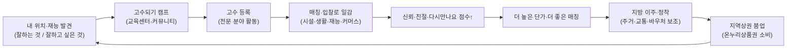

# 우리동네고수 — PLAN-PHASE2.md (확장 비전: 대한민국 휴먼 리소스 디스커버리 플랫폼)

> Phase 1(시설 유지보수 입찰 매칭)을 기반으로, **"누구나 고수가 되고, 어디서나 일하는 대한민국"**을 만드는 2단계 확장 계획.
> 본 문서는 기존 `plan.md`의 후속이며, Phase 1 데이터/계정/평가 구조를 재사용·확장한다.

---

## 0. 한 줄 비전

**"잘하는 일은 고수로 도와주고, 잘하고 싶은 일은 캠프에서 배워서, 전국 어디서나 N잡러로 살아가는 — 대한민국 휴먼 리소스 디스커버리 플랫폼."**

- Phase 1: *시설 유지보수 협력사 매칭* (B2B 본부 중심)
- Phase 2: *모든 사람의 재능·노동·교육·이주를 연결* (B2C·지역경제·글로벌 확장)

---

## 1. 왜 지금인가 (배경)

- **2026년 인력구조**: 경력단절 여성, 50~70대 시니어 등 "일할 수 있는데 연결되지 못한" 인력이 크다.
- **지방소멸·상권침체**: 사람이 지역으로 이동·체류하면 상권이 살아난다(행안부 "생활인구" 개념).
- **N잡·솔로프리너 흐름**: 한 사람이 여러 재능으로 여러 곳에서 일하는 구조가 일반화.
- **외국인 노동 수요**: 합법적·투명한 경로로 미리 알아보고 들어오는 매칭이 필요(언더그라운드 X).

우리동네고수는 이 흐름을 **발견(Discovery) → 교육(Camp) → 매칭(Job) → 이동·정착(Relocation) → 성장(Trust/단가)**의 한 사이클로 묶는다.

---

## 2. 핵심 성장 사이클 (플랫폼 플라이휠)

---

## 3. Phase 2 신규 모듈 (M1~M9)

| # | 모듈 | 한 줄 정의 |
|---|---|---|
| **M1** | 고수 디스커버리 / N잡러 프로필 | "잘하는 분야 = 전문고수 등록", "잘하고 싶은 분야 = 교육 신청"을 한 프로필에서 관리 |
| **M2** | 고수되기 캠프 / 교육센터 / 커뮤니티 | 코스·기수·멘토링·수료(민간자격) — 온라인+오프라인 |
| **M3** | 신뢰도/친절도/다시만나요 점수 + 단가 차등 | 3종 점수로 고수 등급화, 고득점자에 높은 단가 책정 페이지 |
| **M4** | 지방 이주·정착 프로그램 | 지자체 협약 기반 주거·KTX·항공·차편 보조 + 온누리상품권 바우처 |
| **M5** | 1인 커머스 (재능·음식 등) | 고수 개인 브랜드로 상품/음식 판매(식품위생·통신판매 준수) |
| **M6** | 마케팅 자동화 채널 | 영상 촬영→인스타/유튜브 자동 배포, 고수 홍보 자동화 |
| **M7** | 오프라인 거점(우리동네고수 점포) | 남는 임대공간 → 교육+커뮤니티+판매 공간 |
| **M8** | 글로벌 워커 매칭 | 외국인 노동자가 합법적으로 사전 검색·매칭, 다국어, 비자/고용허가 연계 |
| **M9** | 위치기반 "내가 할 수 있는 일" 추천 | 현 위치 기반: 배울 것 + 할 일 + 벌 수 있는 것 추천 |

---

## 4. 확장된 사용자(페르소나)

- **경력단절 여성** — 재진입 위한 교육 + 유연한 N잡.
- **50~70대 시니어** — 보유 기술을 고수로, 부족분은 캠프로.
- **솔로프리너/N잡러** — 여러 재능을 여러 지역에서 수익화.
- **지방 이주 희망자** — 주거·교통 보조 받아 지역에서 일·정착.
- **외국인 노동자/이주민** — 입국 전 합법 매칭·지역 정보 사전 확인.
- **지자체** — 생활인구·상권 활성화 파트너.
- (기존) **본부/경영주/협력사** — Phase 1 연속.

---

## 5. 범위(Scope) — Phase 2 단계화

### Phase 2-A (재능·교육·점수)
- M1 고수 디스커버리 프로필 확장(스킬/희망분야)
- M2 캠프/교육센터 코스·기수·수료
- M3 신뢰/친절/다시만나요 점수 + 단가 차등 페이지
- M9 위치기반 추천(배울 것/할 일/벌이)

### Phase 2-B (커머스·마케팅·오프라인)
- M5 1인 커머스(식품 영업신고 가이드 포함)
- M6 마케팅 자동화(인스타/유튜브, API 약관 준수)
- M7 오프라인 거점 운영 모듈

### Phase 2-C (이주·정착·글로벌)
- M4 지자체 협약 + 주거/교통/바우처(온누리상품권)
- M8 글로벌 워커(다국어, 비자/고용허가제 연계)

---

## 6. 법적·정책 컴플라이언스 개요 (Phase 2 신규) ⚠️ 전문가 검토 필수

> 본 문서는 법률 자문이 아니며, 출시 전 **변호사·노무사·세무사 검토 필수**.

1. **직업안정법 — 가장 중요**
   - 구인·구직을 연결·소개하는 행위는 **직업정보제공사업 신고** 또는 **유료직업소개사업 등록**(국내/국외 구분)이 필요할 수 있음.
   - 플랫폼을 "정보제공·중개" 범위로 설계하되 인력 소개 강도에 따라 등록 검토. 국외(외국인) 알선은 별도 요건.

2. **학원법 / 평생교육법 / 자격기본법(M2 캠프·교육)**
   - 유료·체계적 교육은 **학원 등록 또는 평생교육시설** 요건 검토.
   - 수료증은 **국가자격 오인 금지** → 민간자격은 **자격기본법상 등록** 후 운영.
   - 가능 시 **직업능력개발훈련(고용노동부, 국민내일배움카드/HRD-Net)** 연계.

3. **온누리상품권·바우처·보조금(M4)**
   - 온누리상품권은 **소상공인시장진흥공단** 관리, **부정유통 금지**.
   - 주거·KTX·항공 보조는 **지자체 협약·보조금**(보조금 관리에 관한 법률) 전제, 코레일/항공사 제휴.
   - 행안부 **생활인구**, **지방소멸대응기금** 정책 연계 가능.

4. **식품위생법 / 전자상거래법(M5 음식·커머스)**
   - 음식 판매는 **영업신고**(즉석판매제조가공업·식품제조가공업·일반음식점 등) + **공유주방** 활용.
   - 가정 제조 음식 온라인 판매는 원칙적 제한 → 영업신고 게이트 필수.
   - **통신판매업 신고**, 표시·광고 진실성.

5. **SNS 자동화(M6) — 플랫폼 약관·저작권**
   - 인스타그램/유튜브 **API·자동게시 정책 준수**(과도한 자동화·스팸 금지).
   - 음원·영상 **저작권**, **뒷광고(경제적 이해관계) 표시**(표시광고법).

6. **외국인 고용(M8)**
   - **외국인근로자의 고용 등에 관한 법률(고용허가제 EPS)**, **출입국관리법**, 비자(E-9/E-7/H-2/F계열) 요건.
   - **합법 매칭만** — 불법체류·무허가 알선 금지. 입국 전 "정보 사전 확인" 중심 설계.

7. **점수·단가 차등(M3)**
   - 평가 공정성·이의절차(명예훼손 방지). 단가 차등은 허용되나 **부당 차별 금지**.

8. (기존) 통신판매중개 고지, 개인정보보호법, 위치정보법, 정보통신망법 — Phase 1 유지.

---

## 7. 데이터 자산화 전략

- **사람**: 재능·자격·교육이력·점수의 누적 → "휴먼 리소스 그래프".
- **장소**: 지역별 일감·상권·이주수요·오프라인 거점.
- **시세**: 공종/재능별 단가 + 표준인건비 + 유가(Phase 1 연속).
- **이동**: 거주·교통 보조 흐름 → 생활인구 데이터.
→ 지자체·정부와 공유 가능한 익명 통계로 정책 파트너십.

---

## 8. 성공 지표(Phase 2 KPI)

- 신규 고수 등록 수 / 캠프 수료 후 첫 일감까지 시간
- N잡러 1인당 평균 활동 분야 수 / 월 수익
- 지방 이주·정착 건수, 바우처 소비액(상권 기여)
- 점수 상위 고수의 단가 프리미엄 비율
- 외국인 합법 매칭 건수
- 오프라인 거점 활용률

---

## 9. Phase 2 산출 문서 맵

| 문서 | 역할 |
|---|---|
| `plan-phase2.md` | (본 문서) 확장 비전·모듈·법무·로드맵 |
| `prd-phase2.md` | 신규 기능 요구·유저스토리·플로우 |
| `trd-phase2.md` | 신규 기술/연동(교육·바우처·SNS·글로벌)·보안 |
| `erd-phase2.md` | 데이터 모델 확장(스킬·코스·점수·바우처·커머스·글로벌) |
| `task-phase2.md` | Phase 2-A/B/C 구현 체크리스트 + 수용기준 |
