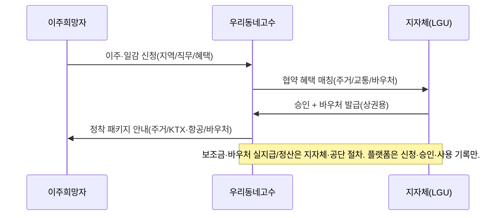

# 우리동네고수 — TRD-PHASE2.md (확장 기술 설계)

> Phase 1 TRD(`trd.md`)의 아키텍처(Next.js + Firebase Auth + Supabase/PostGIS + Edge Functions + FCM + PG)를 **그대로 재사용**하고, 신규 모듈에 필요한 연동·서비스만 추가한다.

---

## 1. 추가 외부 연동

| 모듈 | 연동/서비스 | 비고(서버 전용 키) |
|---|---|---|
| M2 교육 | 동영상 호스팅(Mux/유튜브 비공개) + 결제(PG) | 코스 결제는 Phase 1 PG 재사용 |
| M4 바우처 | 온누리상품권/지자체 협약 연동(가능 시 API, 초기엔 발급·사용 기록 내부관리) | 부정유통 방지 로직 |
| M4 교통 | 코레일/항공 제휴(초기엔 예약·보조 신청 워크플로우) | 보조금 정산 기록 |
| M5 커머스 | 식품 영업신고증 검증(서류 + 관리자 확인), 통신판매 정보 | 영업신고 게이트 |
| M6 마케팅 | 인스타그램 Graph API, YouTube Data API(OAuth 사용자 연동) | API 약관 준수, 예약발행 큐 |
| M8 글로벌 | 다국어(i18n), 비자/고용허가 정보 안내(공식 출처 링크) | 합법 경로만 |
| M9 추천 | PostGIS + 스킬/수요 매칭(내부) | 위치 동의 |

> 신규 비밀키는 모두 **Edge Function/서버 환경변수**에 보관, 클라이언트 노출 금지(Phase 1 원칙 유지).

---

## 2. 신규 Edge Functions

```
supabase/functions/
 ├─ recommend-jobs/     # M9: 위치+스킬+수요 → 배울것/할일/벌이 추천
 ├─ course-enroll/      # M2: 코스 등록·결제·수료 처리
 ├─ score-engine/       # M3: 신뢰/친절/다시만나요 점수 + 등급·단가배수 산출
 ├─ voucher/            # M4: 바우처 발급·사용·검증(부정유통 체크)
 ├─ relocation/         # M4: 이주 신청·주거/교통 보조 워크플로우
 ├─ commerce-verify/    # M5: 식품 영업신고 검증 게이트
 ├─ social-publish/     # M6: 인스타/유튜브 예약발행(약관·뒷광고 표시)
 └─ global-match/       # M8: 외국인 사전 매칭·비자요건 체크 안내
```

---

## 3. 점수·등급·단가 엔진 (M3)

```text
trust  = w1·신뢰지표(약속이행/진위/분쟁無/서류)        # 0~5
kind   = w2·친절지표(요청자 평가)                       # 0~5
again  = w3·재의뢰지표(재구매율/추천의향)               # 0~5
composite = α·trust + β·kind + γ·again                  # 가중합
grade  = bucket(composite)  # 새싹/일반/우수/마스터
rate_multiplier = map(grade) # 예: 1.0 / 1.05 / 1.12 / 1.20
```
- 표본 적을 때 **베이지안 평활**(전체 평균 보정).
- 가중치·배수는 ADMIN 설정값으로 외부화. 단가 배수는 **권장(가이드)**이며 강제 아님.
- 공정성: 점수 근거·표본 수 노출, 이의신청 → 재계산 트리거.

---

## 4. 추천 엔진 (M9)

```sql
-- 현 위치 기준: 할 수 있는 일 + 배우면 좋은 코스
-- 1) 할 일: 내 스킬 ∩ 지역 수요(open requests/jobs)
-- 2) 배울 것: 내 희망분야 ∩ 인근 코스(높은 수요·높은 단가 우선)
-- PostGIS st_dwithin 으로 이동가능 반경 필터
```
- 출력 카드: `{type: job|course|earning, title, distance_m, expected_pay, demand_level}`.
- 위치정보는 동의 기반, 캐시 최소화.

---

## 5. 마케팅 자동화 (M6) — 안전설계

- 사용자가 **본인 SNS 계정을 OAuth로 연동**(플랫폼이 대행 게시 권한 위임).
- **예약발행 큐** → social-publish가 각 플랫폼 API로 게시(레이트리밋·약관 준수).
- 자동 삽입: **뒷광고/협찬 표시 문구**, 저작권 안전 음원·소재만 선택 가능.
- 과도 자동화·스팸 차단(빈도 제한), 실패/거부 로깅.

---

## 6. 바우처·이주 (M4) — 자금 미보관 원칙 유지


- 온누리상품권 바우처: 발급·사용 **추적 + 부정유통 룰**(중복·전매 탐지).
- 플랫폼은 보조금·상품권 대금을 **직접 보관하지 않음**(전자금융·상품권 규제 회피).

---

## 7. 글로벌 워커 (M8)

- i18n: `next-intl` 등으로 한/영(+확장). 사용자 언어 자동 감지.
- 입국 전 사전 매칭: 신원·이력·한국어수준·기술 → 지역/직무 후보 제시(정보 제공 중심).
- 비자/고용허가: **공식 출처(하이코리아·고용허가제 EPS) 안내·연계**, 플랫폼은 합법 요건 충족 여부 체크리스트 제공. **무허가 알선 금지**.

---

## 8. 검증 게이트(공통 패턴)

| 활동 | 통과 조건 |
|---|---|
| 전문고수 활동 | 사업자진위(또는 무사업자 검증) + 평가 |
| 음식 판매(M5) | **영업신고증 검증** |
| 멘토 강의(M2) | 자격/경력 검증 + 관리자 승인 |
| 글로벌 활동(M8) | 비자·고용허가 요건 충족 확인 |
- 게이트 미통과 시 해당 기능 **노출/활성 차단**(RLS + 상태 플래그).

---

## 9. 보안·개인정보(Phase 2 추가)

- 여권/비자/영업신고/자격증 등 **민감 서류**: 법령근거·최소수집·암호화·접근로그.
- SNS 토큰: 암호화 저장, 권한 최소화, 사용자 철회 가능.
- 다국어 동의서·약관 버전관리.
- 모든 신규 테이블 **RLS** 적용.

---

## 10. 폰트·PWA·배포
- Phase 1과 동일(Paperlogy, PWA, PWABuilder APK). 신규 화면도 동일 디자인 토큰 사용.
