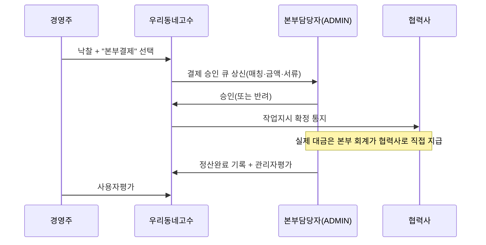

# 우리동네고수 — TRD.md (Technical Requirements Document)

> **어떻게(How)** 만들지를 정의한다. PRD의 기능을 충족하는 기술 설계.

---

## 1. 아키텍처 개요

```mermaid
flowchart TD
  subgraph Client["모바일 PWA (Next.js 14 App Router)"]
    UI["UI / shadcn-ui / Tailwind / Paperlogy"]
    SW["Service Worker (오프라인·푸시)"]
  end

  subgraph Auth["인증"]
    FB["Firebase Auth\n(Google + Email)"]
  end

  subgraph Data["데이터·매칭"]
    SB["Supabase\nPostgreSQL + PostGIS + RLS"]
    EF["Edge Functions\n(매칭·정산·웹훅)"]
    ST["Supabase Storage\n(사진/자격증/견적서)"]
  end

  subgraph Ext["외부 연동"]
    NTS["국세청 사업자진위확인\n(공공데이터포털)"]
    ADDR["도로명주소 API\n(행안부/카카오)"]
    PG["토스페이먼츠 (즉시결제·에스크로)"]
    FCM["Firebase Cloud Messaging"]
    KAKAO["카카오 알림톡(옵션)"]
    OPINET["오피넷 유가(참고단가)"]
    CLAUDE["Anthropic Claude API\n(AI 견적서)"]
  end

  UI --> FB
  FB -->|ID Token (JWT)| SB
  UI --> SB
  UI --> EF
  EF --> NTS
  EF --> PG
  EF --> CLAUDE
  UI --> ADDR
  EF --> FCM
  EF --> KAKAO
  EF --> OPINET
  UI --> ST
```

---

## 2. 인증 ↔ 데이터 연동 (핵심 결정)

- **로그인**은 Firebase Auth(Google/Email) 고정.
- **데이터**는 Supabase(Postgres+PostGIS). 지오매칭·관계형 평점·단가에 유리.
- 연동: **Supabase Third-Party Auth(Firebase) 설정** → 클라이언트가 Firebase **ID 토큰**을 Supabase 요청 헤더로 전달 → RLS가 `auth.jwt()->>'sub'`(= Firebase uid)로 행 단위 인가.
  - 대안(단순화 원하면): Firebase Auth만 사용하고 데이터도 Firestore로 통일 가능하나, **PostGIS 지오매칭/관계형 단가 분석이 약해** 비권장.
- `users` 테이블 PK = Firebase uid(text). 역할은 `user_roles`로 분리(다중역할).

```sql
-- RLS 예시: 본인 견적요청만 조회
create policy owner_select_own_requests on requests
for select using (owner_uid = auth.jwt() ->> 'sub');
```

---

## 3. 기술 스택 상세

| 영역 | 선택 | 비고 |
|---|---|---|
| 프레임워크 | Next.js 14 (App Router) + TypeScript | 모바일 우선 |
| 스타일 | Tailwind CSS + shadcn/ui | 디자인 토큰화 |
| 폰트 | **Paperlogy(페이퍼로지)** self-host woff2 | §8 참조 |
| 상태/데이터 | TanStack Query + Supabase JS | |
| 인증 | Firebase Auth | Google + Email |
| DB | Supabase Postgres + **PostGIS** | 지오매칭 |
| 서버로직 | Supabase Edge Functions (Deno) | 매칭/웹훅/정산/AI 프록시 |
| 스토리지 | Supabase Storage | 이미지/문서 |
| 알림 | FCM(웹푸시) + 카카오 알림톡(옵션) | |
| 결제 | 토스페이먼츠 | 즉시결제·에스크로 |
| AI | Anthropic Claude API | 견적서·요약 (서버 프록시, 키 노출 금지) |
| 배포 | Vercel 또는 Netlify | PWA |
| APK | PWABuilder | manifest 기반 |

---

## 4. 외부 API 연동 명세

### 4.1 사업자등록 진위확인 (국세청 / data.go.kr)
- 서비스: "사업자등록정보 진위확인 및 상태조회".
- 입력: 사업자등록번호(+대표자명·개업일자 등 진위확인 시).
- 출력: 유효성, 사업자 **상태(계속/휴업/폐업)**, 과세유형.
- 적용 지점: 협력사 등록 시 **서버(Edge Function)에서 호출** → 통과 시에만 `business_verifications.verified=true`.
- 키 보관: 서비스키는 서버 환경변수, 클라이언트 노출 금지.

### 4.2 주소·좌표 (도로명주소: 행안부 또는 카카오)
- 주소검색 → 도로명/지번 + **위경도** + 시도/시군구 코드.
- 협력사 서비스지역, 요청 위치 모두 좌표화 → PostGIS 거리 계산.

### 4.3 결제 (토스페이먼츠)
- 즉시결제: 결제위젯 → 승인 웹훅(Edge Function) → `payments` 갱신 → 에스크로 → 완료확인 후 정산.
- **본부결제: PG 미경유.** 승인 워크플로우만 기록, 실지급은 본부 회계 프로세스(플랫폼은 자금 미보관).

### 4.4 알림 (FCM / 카카오 알림톡)
- FCM 토큰 등록(PWA) → 이벤트 발생 시 서버에서 발송.
- 수신동의·야간(21~08시) 제한 로직 서버에서 강제.

### 4.5 유가/표준단가 (오피넷 등 공개데이터)
- 주기적 수집 → `price_references` 적재 → 대시보드 "참고용" 표기.

### 4.6 AI 견적서 (Claude API)
- **반드시 서버 프록시**(Edge Function)로 호출, API 키 클라이언트 노출 금지.
- 입력(공종·항목·수량) → 표준 견적서 JSON → 프론트에서 PDF 렌더.
- 출력에 거짓·과장 방지 가이드, "AI 생성 초안" 워터마크.

---

## 5. 매칭 엔진 설계

```sql
-- 후보 협력사: 공종 보유 + 서비스 반경 내 + 상태 승인
select p.id, p.name,
       st_distance(p.geom, st_setsrid(st_makepoint(:lng,:lat),4326)::geography) as dist_m,
       coalesce(s.score, 0) as score
from partner_profiles p
join partner_categories pc on pc.partner_id = p.id and pc.category_id = :category_id
left join partner_category_region_scores s
       on s.partner_id = p.id and s.category_id = :category_id and s.sigungu_code = :sigungu
where p.status = 'approved'
  and st_dwithin(p.geom, st_setsrid(st_makepoint(:lng,:lat),4326)::geography, p.service_radius_m)
order by (0.5*coalesce(s.score,0)
        + 0.3*(1 - least(dist_m, p.service_radius_m)/p.service_radius_m)*5
        + 0.2*p.responsiveness) desc
limit 30;
```

- 가중치(평점/근접도/응답성)는 ADMIN 설정값으로 외부화.
- 매칭 결과 → 알림 큐 → FCM/알림톡.

---

## 6. 보안 & 권한

- **RLS 전면 적용**: 모든 테이블 역할·소유자 기준 정책. 기본 deny.
- 역할 검증은 `user_roles` 조인 함수(`auth_role()`)로 단일화.
- 민감정보: 주민번호는 **원천징수 등 법령근거 있을 때만** 수집, 컬럼 암호화(pgcrypto)·접근 최소화·마스킹.
- 파일 업로드: 서명 URL, 용량·확장자 검증, 바이러스성 콘텐츠 차단.
- 비밀키(국세청/PG/Claude): 서버 환경변수, **클라이언트 절대 노출 금지**.
- 감사로그(`audit_logs`): 권한변경·승인·결제·평가.
- 통신판매중개 고지·약관 동의 버전 기록.

---

## 7. PWA 구현

- `public/manifest.webmanifest`: name "우리동네고수", short_name "고수", display standalone, theme/background color, 아이콘(192/512/maskable).
- Service Worker(`next-pwa` 또는 커스텀): 앱셸 캐시, 오프라인 폴백, FCM 백그라운드 수신.
- 설치 프롬프트(A2HS) + iOS Safari 안내.
- **APK**: 빌드 후 `pwabuilder.com`에 배포 URL 입력 → Android 패키지(.apk/.aab) 생성/다운로드.

---

## 8. 폰트(Paperlogy) 적용

1. Paperlogy 폰트 파일(woff2, 굵기별)을 공식 배포처에서 다운로드해 `/public/fonts/paperlogy/`에 배치(라이선스 확인 필수).
2. CSS:
```css
@font-face{
  font-family:"Paperlogy";
  src:url("/fonts/paperlogy/Paperlogy-4Regular.woff2") format("woff2");
  font-weight:400; font-display:swap;
}
@font-face{
  font-family:"Paperlogy";
  src:url("/fonts/paperlogy/Paperlogy-7Bold.woff2") format("woff2");
  font-weight:700; font-display:swap;
}
```
3. Tailwind: `fontFamily.sans = ['Paperlogy', ...system]`.

---

## 9. 폴더 구조(예시)

```
src/
 ├─ app/                  # App Router (role별 라우트 그룹: (owner)/(partner)/(admin))
 ├─ components/ui/        # shadcn
 ├─ features/
 │   ├─ auth/  request/  bidding/  matching/  partner/  rating/  payment/  pricing/  ai-quote/
 ├─ lib/ (firebase, supabase, fcm, toss, claude-proxy)
 ├─ hooks/  stores/  types/
public/
 ├─ manifest.webmanifest  fonts/paperlogy/  icons/
supabase/
 ├─ migrations/  functions/ (match, verify-biz, toss-webhook, ai-quote, notify)
```

---

## 10. 환경변수(요약)

```
NEXT_PUBLIC_FIREBASE_*          # 클라 노출 가능(공개키)
NEXT_PUBLIC_SUPABASE_URL/ANON
SUPABASE_SERVICE_ROLE           # 서버 only
NTS_BIZ_API_KEY                 # 국세청, 서버 only
TOSS_SECRET_KEY                 # 서버 only
ANTHROPIC_API_KEY               # 서버 only
KAKAO_REST_API_KEY              # 주소/알림톡, 서버 only
FCM_SERVER_KEY / VAPID
```

---

## 11. 데이터 흐름 — 본부결제(자금 미보관 핵심)


> 플랫폼은 자금을 보관/중계하지 않음 → 전자금융업 라이선스 리스크 회피.
